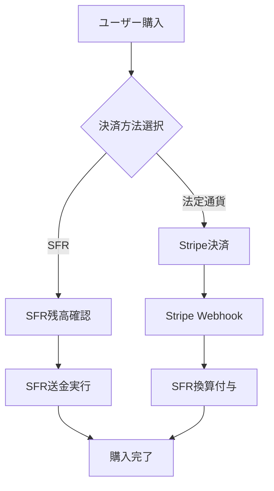

# Phase 5: Stripe決済統合実装計画

## 🎯 Phase 5目標: SFR暗号資産 ↔ Stripe連携システム確立

### 📋 実装概要

**目的**: SFR暗号資産システムとStripe決済の完全統合  
**スコープ**: バックエンドAPI + フロントエンド決済UI + 換算システム  
**期間**: 2-3週間（集中実装）

## 🏗️ アーキテクチャ設計

### 1. 決済フロー設計


### 2. 換算レート管理
- **リアルタイム換算**: 1 SFR = 法定通貨レート
- **レート更新頻度**: 1分毎（API経由）
- **手数料計算**: Stripe手数料3.6% + プラットフォーム手数料

### 3. データベース拡張
```sql
-- Stripe決済テーブル
CREATE TABLE stripe_payments (
    id BIGINT PRIMARY KEY,
    user_id VARCHAR(255) NOT NULL,
    stripe_payment_intent_id VARCHAR(255) UNIQUE,
    amount_jpy DECIMAL(10,2),
    amount_sfr DECIMAL(18,8),
    exchange_rate DECIMAL(18,8),
    status VARCHAR(50),
    created_at TIMESTAMP,
    completed_at TIMESTAMP
);

-- 換算レートテーブル  
CREATE TABLE exchange_rates (
    id BIGINT PRIMARY KEY,
    from_currency VARCHAR(10),
    to_currency VARCHAR(10),
    rate DECIMAL(18,8),
    timestamp TIMESTAMP,
    source VARCHAR(100)
);
```

## 🚀 実装ステップ

### ステップ1: バックエンドStripe統合
- [ ] Stripe SDK設定
- [ ] PaymentIntent API実装
- [ ] Webhook署名検証
- [ ] 決済状態管理

### ステップ2: SFR↔法定通貨換算API
- [ ] 換算レート管理サービス
- [ ] リアルタイムレート更新
- [ ] 手数料計算ロジック
- [ ] 換算履歴記録

### ステップ3: フロントエンド決済UI
- [ ] Stripe Elements統合
- [ ] 決済方法選択画面
- [ ] SFR残高表示・決済
- [ ] 決済結果画面

### ステップ4: 統合テスト
- [ ] 決済フロー完全テスト
- [ ] エラーハンドリング
- [ ] パフォーマンステスト
- [ ] セキュリティ検証

## 📊 実装順序提案

### 🎯 推奨実装順序

1. **Phase 5.1: バックエンドStripe基盤** (1週間)
   - Stripe SDK設定・認証
   - PaymentIntent管理API
   - 基本的な決済フロー

2. **Phase 5.2: SFR換算システム** (1週間)  
   - 換算レート管理
   - SFR⇔JPY変換API
   - 手数料計算システム

3. **Phase 5.3: フロントエンド決済UI** (1週間)
   - Stripe Elements実装
   - 決済画面統合
   - UX最適化

## 🔧 技術スタック

### バックエンド
- **Spring Boot**: Stripe Java SDK統合
- **PostgreSQL**: 決済・換算履歴管理
- **Redis**: 換算レートキャッシュ

### フロントエンド  
- **React + TypeScript**: 決済UI実装
- **Stripe.js**: Elements統合
- **SFR SDK**: 暗号資産決済連携

### セキュリティ
- **Stripe Webhook署名**: イベント検証
- **CSRFトークン**: フロントエンド保護
- **SSL/TLS**: 通信暗号化

## 📋 Phase 5実装開始

最初に実装する領域をお選びください：

**A. Phase 5.1: バックエンドStripe基盤構築**
- Stripe SDK設定
- PaymentIntent API実装
- 基本決済フロー

**B. Phase 5.2: SFR換算システム優先**
- 換算レート管理
- SFR⇔JPY変換API  
- 手数料計算

**C. Phase 5.3: フロントエンド決済UI優先**
- Stripe Elements統合
- 決済方法選択画面
- SFR決済UI

どの領域から開始しますか？
